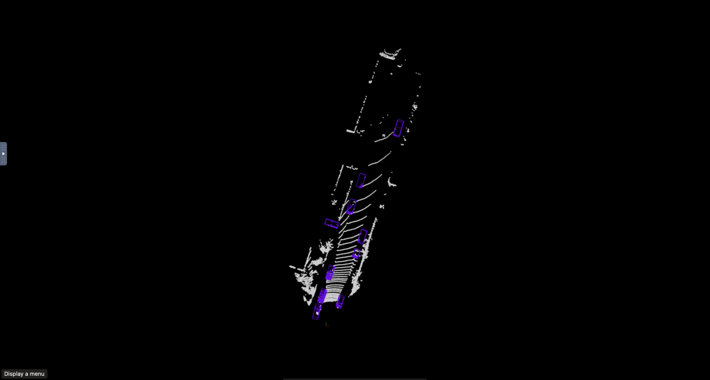
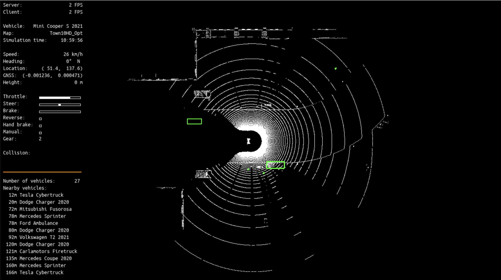
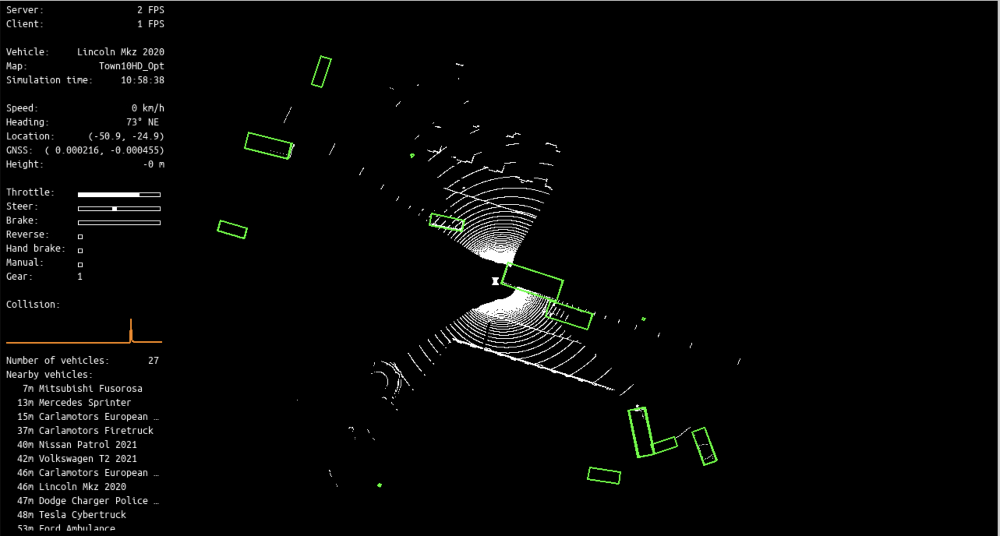
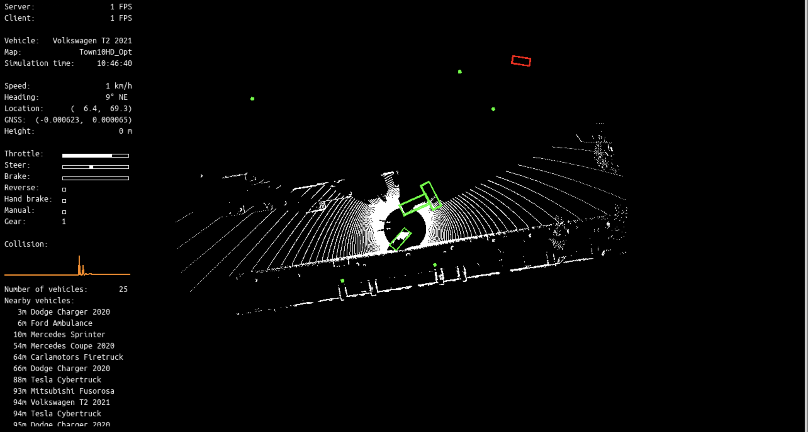

# EE260C_LAB1: Perception

Please refer to the instructions [here](https://docs.google.com/document/d/1BvQ9ztEvxDwsHv-RWEy2EOA7kdAonzdkbJIuQSB1nJI/edit?usp=sharing)

## Lab 1 - Divyank Shah (dshah048)

### Sensor Setup

1. LiDAR - 64 Channels
2. Left Camera - 1280 x 720
3. Right Camera - 1280 x 720
4. GNNS (GPS)

### Model Used

PointPillars from MMDetection3D

#### Execution Verification on Kitti Dataset

### Visualize Ground Truth

### PointPillars Detection

